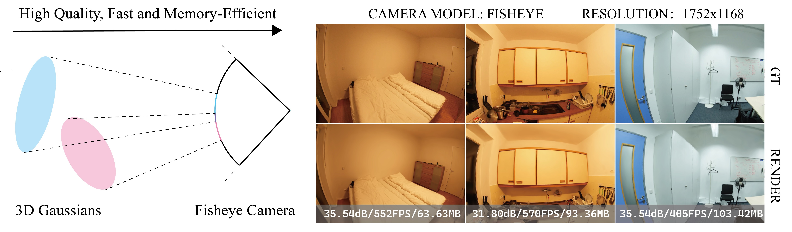

# Fisheye-GS




**Abstract**: Recently, 3D Gaussian Splatting (3DGS) has garnered at-
tention for its high fidelity and real-time rendering. However, adapting
3DGS to different camera models, particularly fisheye lenses, poses chal-
lenges due to the unique 3D to 2D projection calculation. Additionally,
there are inefficiencies in the tile-based splatting, especially for the ex-
treme curvature and wide field of view of fisheye lenses, which are crucial
for its broader real-life applications. To tackle these challenges, we intro-
duce Fisheye-GS⋆. This innovative method recalculates the projection
transformation and its gradients for fisheye cameras. Our approach can
be seamlessly integrated as a module into other efficient 3D rendering
methods, emphasizing its extensibility, lightweight nature, and modular
design. Since we only modified the projection component, it can also
be easily adapted for use with different camera models. Compared to
methods that train after undistortion, our approach demonstrates a clear
improvement in visual quality.

## TODO
+ Release Paper
+ Release Fisheye-GS for FlashGS
+ Release the dataset we use
+ Release panorama
### Hardware Requirements

- CUDA-ready GPU with Compute Capability 7.0+
- 24 GB VRAM (to train to paper evaluation quality)

### Software Requirements
- Conda (recommended for easy setup)
- C++ Compiler for PyTorch extensions (we used Visual Studio 2019 for Windows)
- CUDA SDK 11 for PyTorch extensions, install *after* Visual Studio
- C++ Compiler and CUDA SDK must be compatible

## Setup
```shell
conda env create --file environment.yml
conda activate fisheye_gs
```
## Prepare Training Data on Scannet++ Dataset
Undistort the distortions excluding the radial distortion from $k_1$
```shell
python prepare_scannetpp.py \
    --path <path to your dataset> \
    --src images \
    --dst image_undistorted_fisheye 
```
Or simply use:
```shell
sh scripts/prepare.sh
```
## Training on Scannet++ Dataset
```shell
python train.py \
    -s <path to your dataset> \
    -m <path to model to be trained> \
    --images <relative path to images> \
    --colmaps <relative path to colmap file if using dataset> \
    --bs 3 \
    --ds 1 \
    --fisheye \
    --train_random_background 
```
Or simply use:
```shell
sh scripts/train.sh
```
## Rendering on Scannet++ Dataset
```shell
python render.py \
    -s <path to your dataset> \
    -m <path to model to be trained> \
    --images <relative path to images> \
    --colmaps <relative path to colmap file if using dataset> \
    --skip_train \
    --fisheye \
    --ds 1 \
    -r 1 
```
Or simply use
```shell
sh scripts/render.sh
```
## Evaluating
```shell
python metrics.py \
    -m <path to model to be trained>
```
Or simply use
```shell
sh scripts/eval.sh
```

## License
Please follow the LICENSE of <a href='https://github.com/graphdeco-inria/gaussian-splatting'>3D-GS</a>.

## Acknowledgement
We thank all authors from <a href='https://github.com/graphdeco-inria/gaussian-splatting'>3D-GS</a> for presenting such an excellent work.
